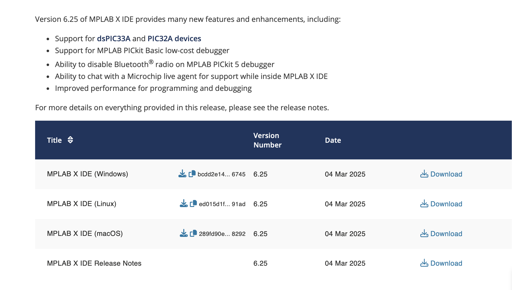
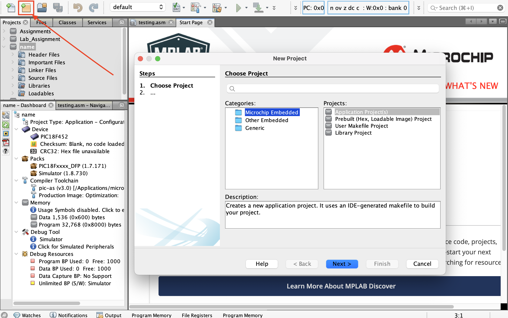
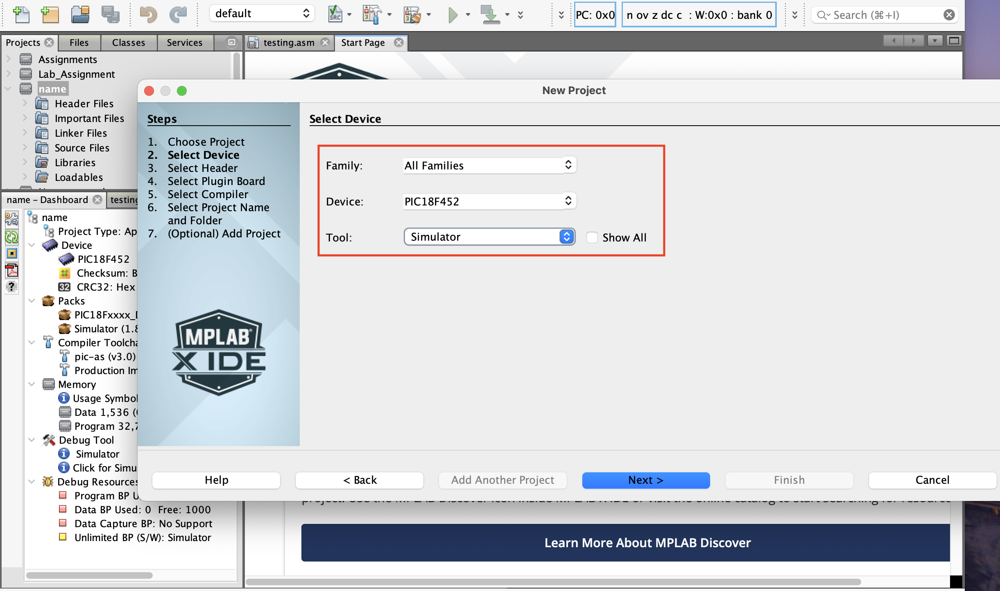

# MPLAB X setup for PIC18F452 on macOS
## Overview
This repository provides a step-by-step guide to setting up MPLAB X IDE on macOS for programming the PIC18F452 microcontroller using PIC Assembler (PIC AS). It includes installation instructions, project configuration, sample assembly code, and troubleshooting tips

## Getting Started
### 1. Install MPLAB X IDE and PIC Assembler
When you open the link scroll down and select the MacOS version
- Download[ MPLAB X Official Website](https://www.microchip.com/en-us/tools-resources/develop/mplab-x-ide)
 

 <strong>Possible Issues during installation:</strong> 

### 2. Configure MPLAB X for PIC18F452
Once you've opened MPLAB X IDE follow these steps to create a new project and configure it for the **PIC18F452** using pic-as(assembler)
You should be here:
 
  #### 1. Create a New project
  Go to File, then New Project to start a new project
  
  #### 2. Select your Project type
  - In the "New Project", under **categories**, select **Microchip Embedded**
  - Then click next
  #### 3. Select your device
  In the **Select Device** dropdown, choose **PIC18F452**. This is the microcontroller you will be programming.
    **Tip**: To easily find the a specific device, type "PIC18F452" into the search bar at the top of the Device List.
  #### 4. Select your tool
  In the tools section, select **Simulator**

 
  #### 5. Choose a Compiler
  When you reach **Comiler** Section, select pic-as.
    - pic-as is the assembler used to compile assembly code for PIC microcontrollers
    - Use the latest version of the pic-as to avoid any compatibility issues.
    NOTE: You won't need to use XC8 C compiler since you will be working with assembly lanauage.
  #### 6. Set Project Name and Location
  Choose a name for your project, click **Finish** and thats it

 <strong>Possible that may occur:</strong> 

